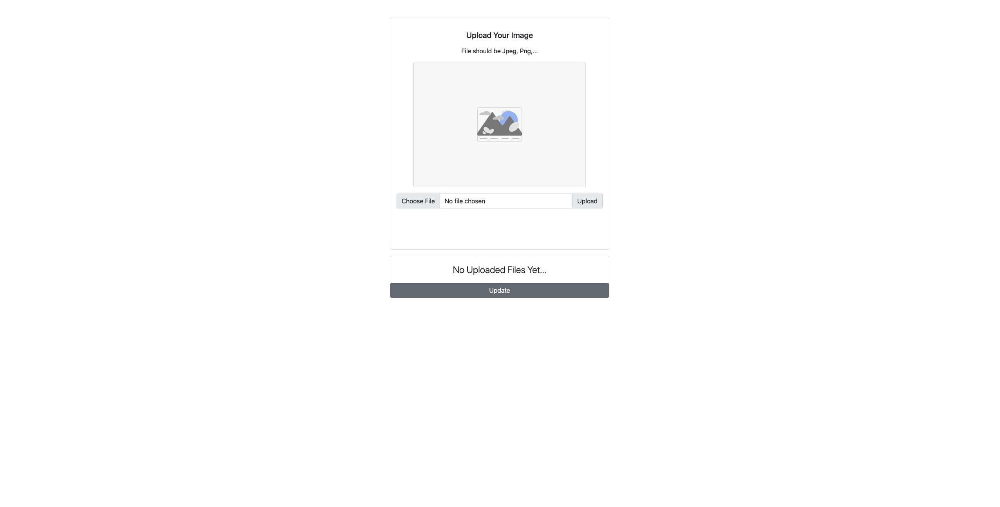

<h1 align="center">Image Uploader</h1>

<!-- TABLE OF CONTENTS -->

## Table of Contents

- [Overview](#overview)
  - [Built With](#built-with)
- [Features](#features)
- [How to use](#how-to-use)
- [Contact](#contact)
- [Acknowledgements](#acknowledgements)

<!-- OVERVIEW -->

## Overview



This is the interface you will see when loading the page. From here you will be able to upload photos and see previous uploaded files. As my first project, I learned a lot about frontend css and how to position containers. Also, learning how to implement bootstrap in react. Coding out the entire full-stack app gave me exposure to knowing how to approach website creation and implementing features that require both the frontend and backend.

### Built With

<!-- This section should list any major frameworks that you built your project using. Here are a few examples.-->

- [React](https://reactjs.org/)
- [BootStrap](https://getbootstrap.com/)
- [Express](http://expressjs.com/)
- [Mongoose](https://mongoosejs.com/)

## Features

<!-- List the features of your application or follow the template. Don't share the figma file here :) -->

- Upload images to backend
- Load Image to Frontend
- Update list of uploaded files
- Delete files from list

## How To Use

<!-- Example: -->

To clone and run this application, you'll need [Git](https://git-scm.com) and [Node.js](https://nodejs.org/en/download/) (which comes with [npm](http://npmjs.com)) installed on your computer. From your command line:

```bash
# Clone this repository
$ git clone https://github.com/Jamesmjkim/image-uploader

# Install dependencies
$ npm install

# Go into server folder
$ cd server

# Run the app
$ npm run dev
```

## Acknowledgements

<!-- This section should list any articles or add-ons/plugins that helps you to complete the project. This is optional but it will help you in the future. For example -->

- [Node.js](https://nodejs.org/)
- [React](https://reactjs.org/)
- [BootStrap](https://getbootstrap.com/)
- [Express](http://expressjs.com/)
- [Mongoose](https://mongoosejs.com/)

## Contact

- LinkedIn [James M Kim](https://www.linkedIn.com/in/jamesmjkim)
- GitHub [@Jamesmjkim](https://github.com/Jamesmjkim)
